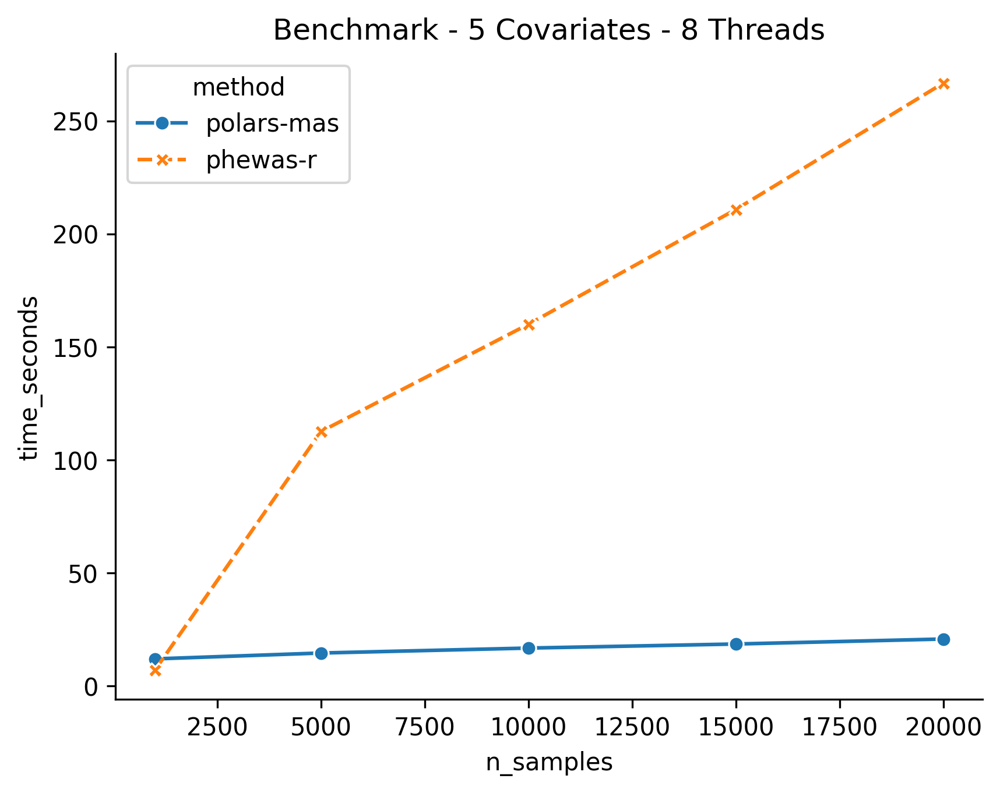
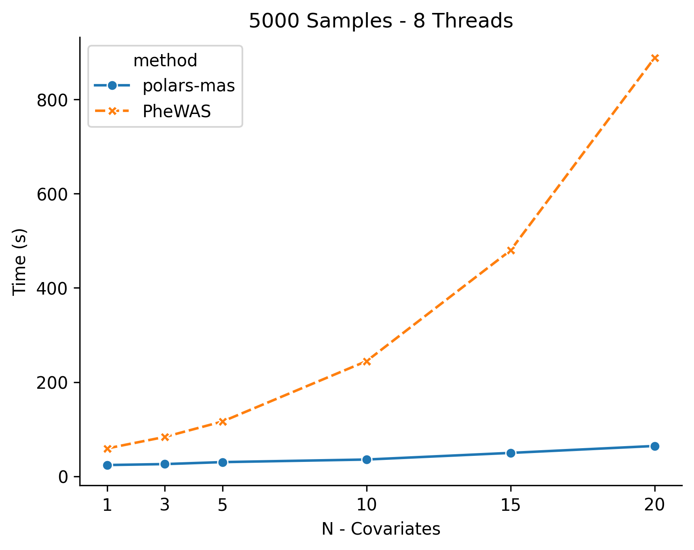
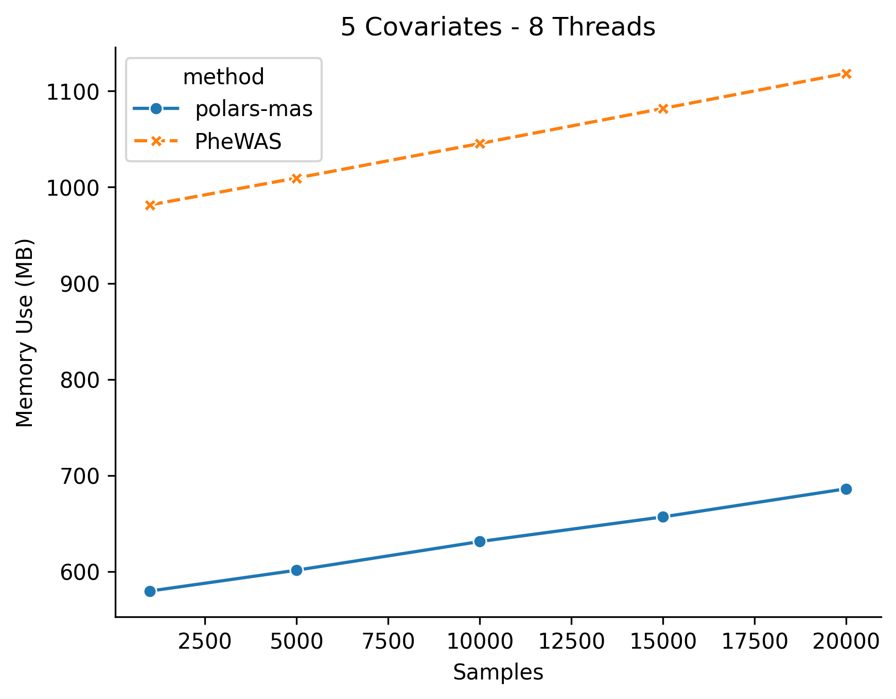
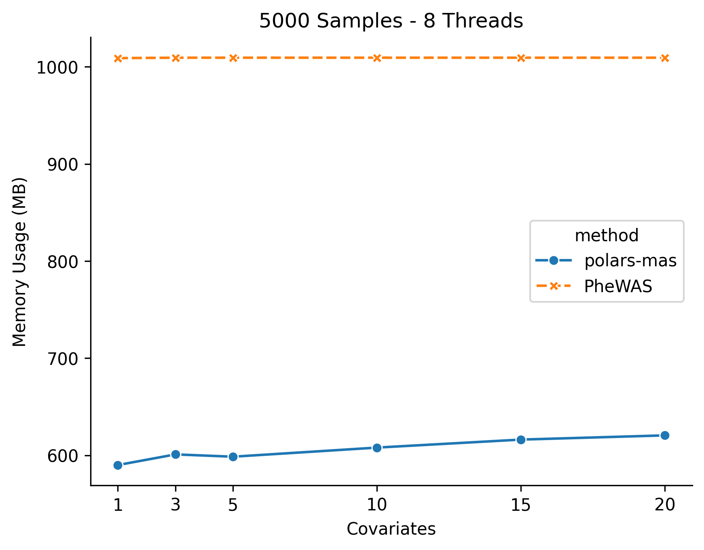
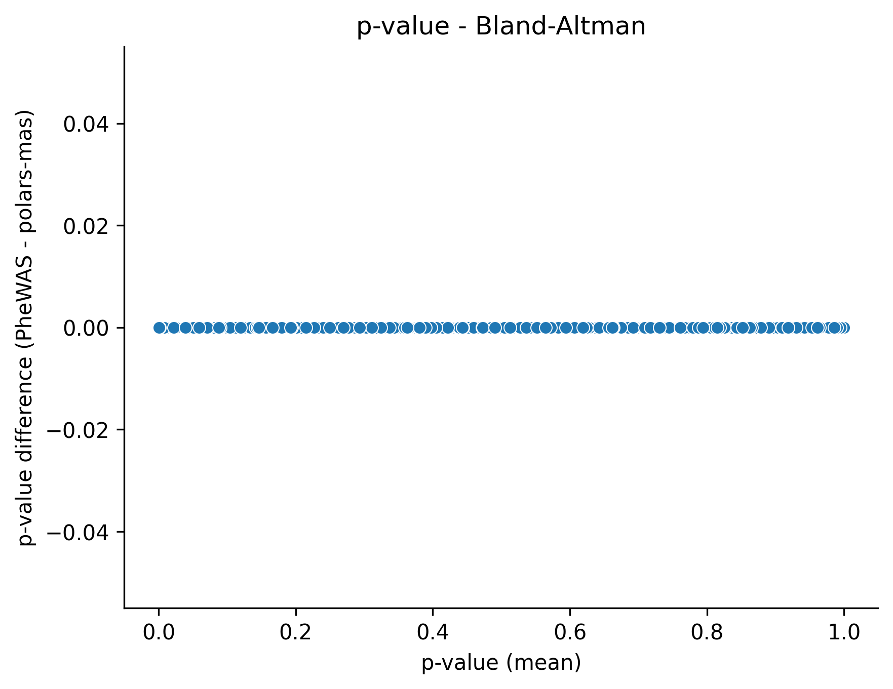
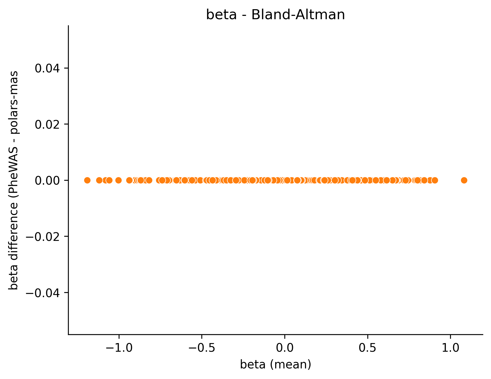

# Benchmarks

This directory contains benchmarks comparing `polars-mas` against the original R [PheWAS](https://github.com/PheWAS/PheWAS) package.

## Performance

### Sample Size Scaling

Benchmark conditions: 5 covariates, ~1,800 phecodes, 8 threads



| Sample Size | polars-mas (s) | PheWAS (s) | Speedup |
|-------------|----------------|------------|---------|
| 1,000       | 7.3            | 7.1        | 1.0x    |
| 5,000       | 22.2           | 112.6      | 5.1x    |
| 10,000      | 33.2           | 160.0      | 4.8x    |
| 15,000      | 42.5           | 210.8      | 5.0x    |
| 20,000      | 56.5           | 266.7      | 4.7x    |

### Covariate Scaling

Benchmark conditions: 5,000 samples, ~1,800 phecodes, 8 threads



| Covariates | polars-mas (s) | PheWAS (s) | Speedup |
|------------|----------------|------------|---------|
| 1          | 17.2           | 90.2       | 5.2x    |
| 3          | 19.9           | 86.3       | 4.3x    |
| 5          | 22.5           | 116.1      | 5.2x    |
| 10         | 26.8           | 247.7      | 9.3x    |
| 15         | 41.1           | 487.4      | 11.9x   |
| 20         | 55.7           | 901.6      | 16.2x   |

As the number of covariates increases, `polars-mas` shows increasingly better performance relative to PheWAS, achieving up to **16.2x speedup** with 20 covariates.

## Memory Usage

### Memory by Sample Size

Benchmark conditions: 5 covariates, ~1,800 phecodes, 8 threads



| Sample Size | polars-mas (MB) | PheWAS (MB) | Reduction |
|-------------|-----------------|-------------|-----------|
| 1,000       | 579.7           | 981.6       | 41%       |
| 5,000       | 601.4           | 1009.6      | 40%       |
| 10,000      | 631.2           | 1045.4      | 40%       |
| 15,000      | 656.9           | 1082.0      | 39%       |
| 20,000      | 686.1           | 1118.5      | 39%       |

### Memory by Covariate Count

Benchmark conditions: 5,000 samples, ~1,800 phecodes, 8 threads



| Covariates | polars-mas (MB) | PheWAS (MB) | Reduction |
|------------|-----------------|-------------|-----------|
| 1          | 590.0           | 1009.0      | 42%       |
| 3          | 601.0           | 1009.4      | 40%       |
| 5          | 598.6           | 1009.4      | 41%       |
| 10         | 608.0           | 1009.4      | 40%       |
| 15         | 616.2           | 1009.4      | 39%       |
| 20         | 620.6           | 1009.4      | 39%       |

## Numerical Agreement

To validate that `polars-mas` produces identical results to the original PheWAS package, we compared output metrics using Bland-Altman plots. All differences were computed and rounded to 8 decimal places.

### P-value Agreement



### Beta Coefficient Agreement



Both plots show all 1,801 phenotype comparisons lying exactly on the zero line, demonstrating that `polars-mas` and PheWAS produce results that agree within a tolerance of **1e-8**.

## Test Environment

All benchmarks were run on the following system:

| Component | Specification |
|-----------|---------------|
| CPU       | Intel Xeon Gold 6132 @ 2.60GHz (14 cores, 28 threads) |
| Memory    | 64 GB |
| OS        | Ubuntu 22.04.5 LTS |
| Kernel    | 6.8.0-90-generic |

## Reproducing Benchmarks

To reproduce these benchmarks:

```bash
# Generate example datasets
Rscript generate_examples.R

# Run sample size scaling benchmarks
./run_benchmarks.sh

# Run covariate scaling benchmarks
./run_covariate_scaling_benchmarks.sh

# Generate plots
jupyter notebook benchmark_plotting.ipynb
```
